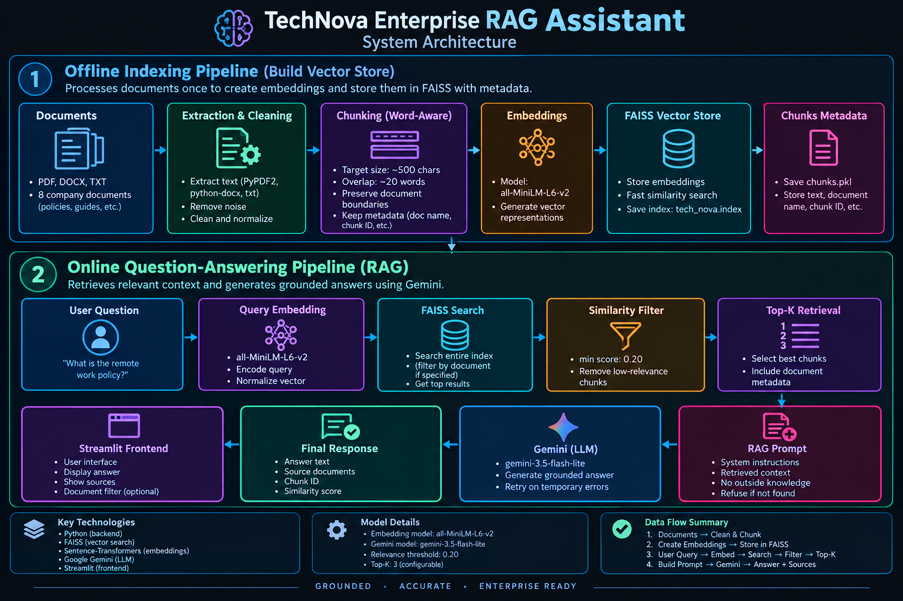
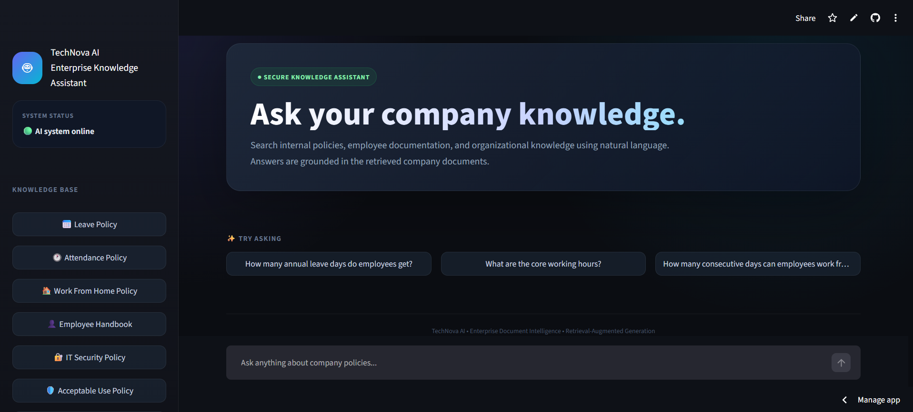
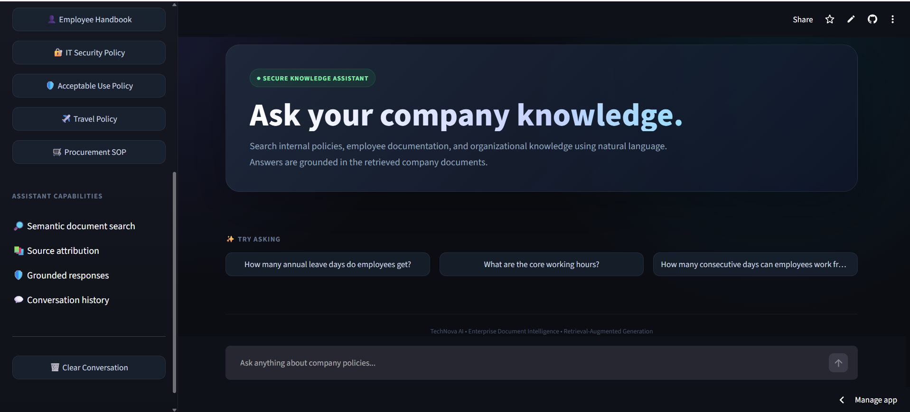
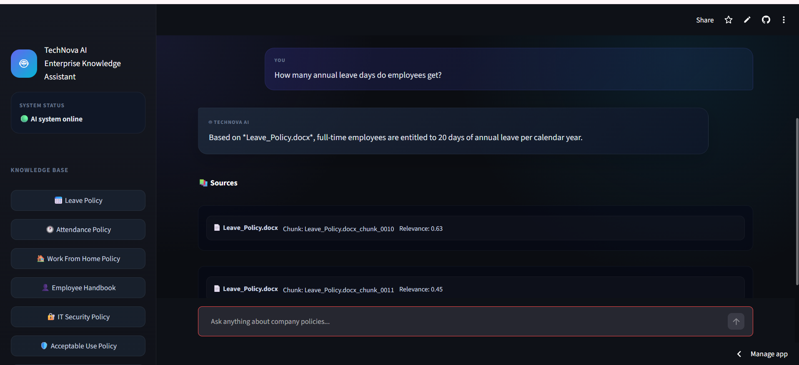
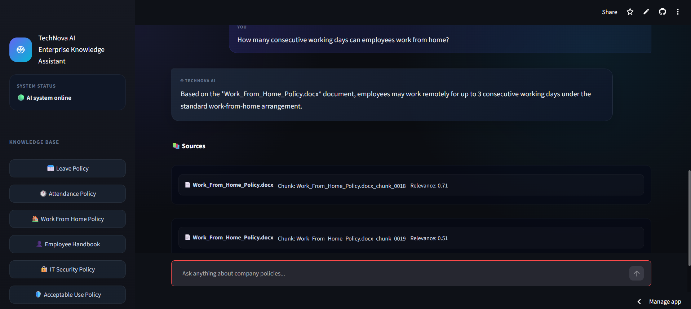
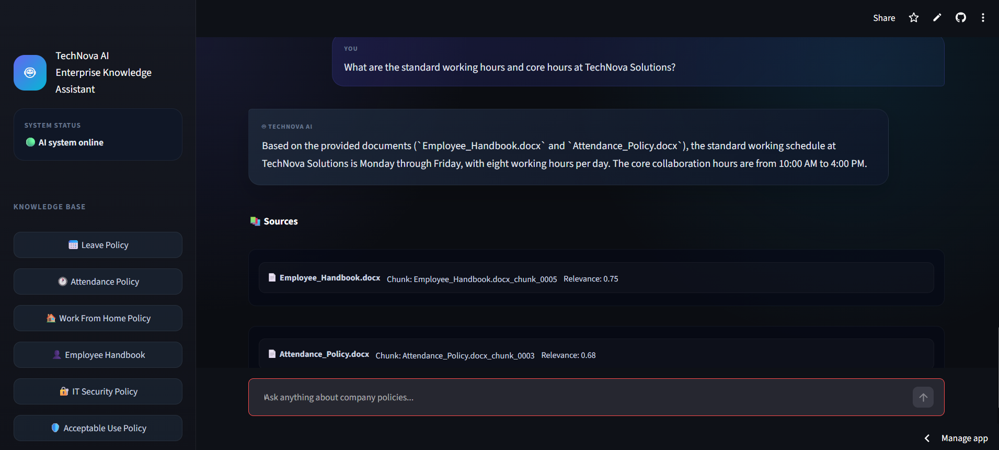
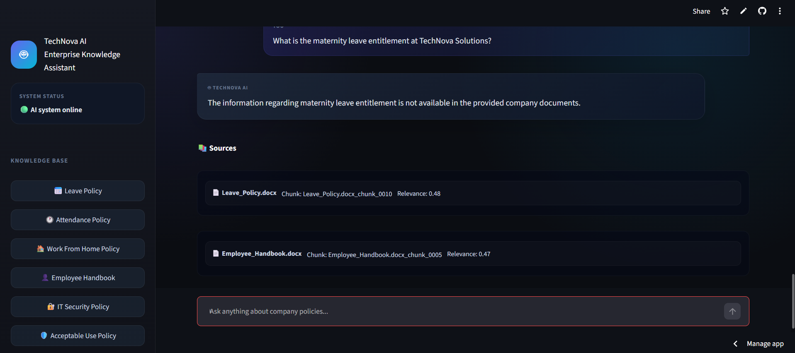
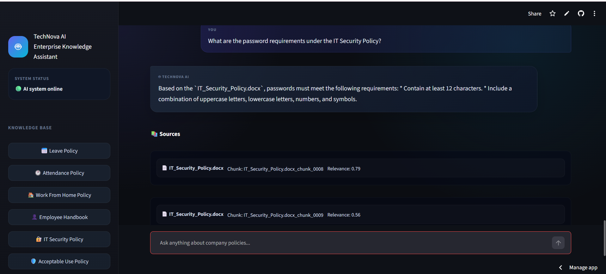
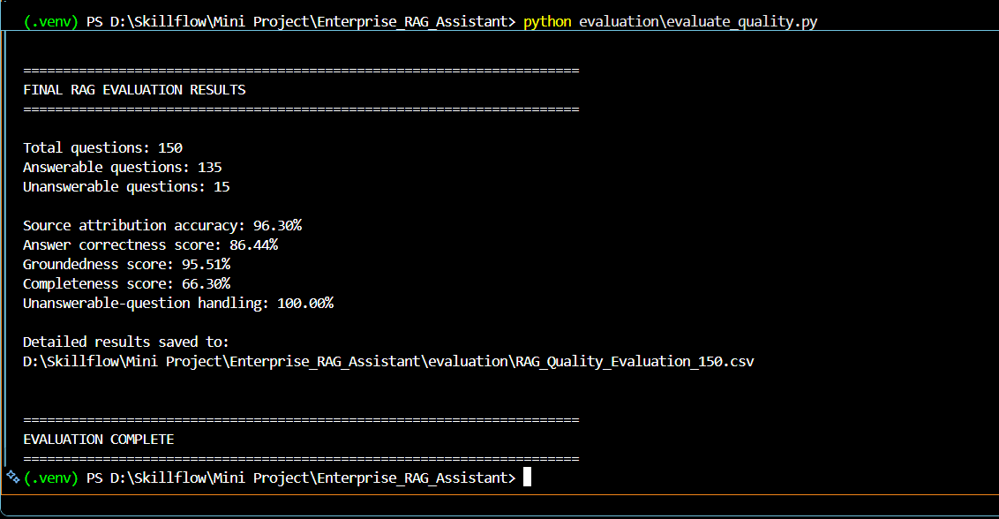

# 🧠 Enterprise RAG Assistant

An AI-powered **Enterprise Retrieval-Augmented Generation (RAG) Assistant** designed to answer questions from internal organizational documents.

The system retrieves relevant information from company policies and standard operating procedures and uses **Google Gemini** to generate grounded responses based only on the retrieved company knowledge.

---

## 🏢 Organization

**TechNova Solutions**

The knowledge base consists of internal organizational policies, procedures, and standard operating documents.

---

## 🎯 Business Problem

Organizations often maintain important policies and procedures across multiple documents. Employees may need to manually search through these documents to find information about leave, attendance, security, travel, procurement, and other workplace policies.

This project addresses that problem by providing a natural-language question-answering system that allows employees to ask questions directly and receive answers supported by the relevant company documents.

---

## 🎯 Project Objective

The objective of this project is to develop an enterprise document intelligence assistant that:

* Processes organizational documents.
* Extracts and cleans document text.
* Splits documents into searchable chunks.
* Generates semantic embeddings.
* Stores embeddings in a FAISS vector index.
* Retrieves relevant information for user questions.
* Uses Google Gemini to generate grounded answers.
* Displays source documents and relevance scores.
* Reduces unsupported answers through retrieval-based grounding.
* Evaluates retrieval and answer quality using a 150-question evaluation dataset.

---

## ✨ Key Features

* 🤖 AI-powered question answering
* 📚 Retrieval-Augmented Generation (RAG)
* 📄 DOCX document processing
* 🔎 Semantic document retrieval
* 🧠 Sentence Transformer embeddings
* ⚡ FAISS vector similarity search
* 🎯 Top-K retrieval
* 📊 Similarity/relevance scores
* 🛡️ Grounded answer generation
* 🚫 Unanswerable-question handling
* 📑 Source attribution
* 🗂️ Document-specific filtering
* 💬 Google Gemini LLM integration
* 🎨 Streamlit web interface
* 📊 150-question RAG evaluation
* 🧪 Chunking strategy experiment
* ☁️ Streamlit Community Cloud deployment

---

## 🏗️ System Architecture



The system consists of two major pipelines: an **offline document indexing pipeline** and an **online question-answering pipeline**.

### Offline Document Indexing Pipeline

```text
Company DOCX Documents
        ↓
Document Loading
        ↓
Text Extraction & Cleaning
        ↓
Chunking + Metadata
        ↓
Sentence Transformer
all-MiniLM-L6-v2
        ↓
Embedding Vectors
        ↓
FAISS Vector Index
        +
Chunk Metadata
```

### Online Question-Answering Pipeline

```text
User Question
        ↓
Query Embedding
(all-MiniLM-L6-v2)
        ↓
FAISS Similarity Search
        ↓
Similarity Threshold
        ↓
Top-K Relevant Chunks
        ↓
RAG Prompt
        ↓
Google Gemini
(gemini-3.5-flash-lite)
        ↓
Grounded Answer
        +
Source Documents
        +
Relevance Scores
```

---

## 📄 Document Processing

The document processing pipeline prepares the organizational documents for semantic retrieval.

The system loads the DOCX documents, extracts their textual content, performs basic text cleaning, and preserves document-level and paragraph-level metadata.

The processed text is then passed to the chunking stage, where documents are divided into smaller retrieval units without crossing document boundaries.

The complete document processing and indexing workflow is implemented in the project setup notebook:

```text
01_project_setup.ipynb
```

---

## ✂️ Chunking Strategy

The documents are processed separately to ensure that chunks never cross document boundaries.

A **word-aware chunking strategy** is used with a target chunk size of approximately **500 characters**. To preserve contextual continuity between adjacent chunks, the implementation retains an overlap of approximately **20 words** from the previous chunk.

Each chunk also preserves its associated document name and paragraph metadata.

### Production Chunking Configuration

| Parameter         | Value                         |
| ----------------- | ----------------------------- |
| Target chunk size | ~500 characters               |
| Overlap           | ~20 words                     |
| Chunking method   | Word-aware                    |
| Document boundary | Preserved                     |
| Metadata          | Document name + paragraph IDs |

### Chunking Experiment

Three chunk configurations were experimentally compared:

| Chunk Size | Overlap | Total Chunks | Average Length |
| ---------: | ------: | -----------: | -------------: |
|        300 |      50 |           37 |         274.62 |
|        500 |     100 |           24 |         429.88 |
|        700 |     150 |           17 |         592.47 |

The **500-character configuration** provides a practical balance between retrieval granularity and contextual information. Smaller chunks provide more granular retrieval but increase the number of chunks, while larger chunks provide more context but may reduce retrieval precision.

The chunking experiment was performed separately and did **not modify the production vector store**.

The experimental comparison uses **character-based chunking configurations** to study the effect of chunk size and overlap, while the production pipeline uses the final **word-aware chunking strategy with approximately 20-word overlap** described above.

---

## 🧠 Embeddings

After chunking, each text chunk is converted into a numerical vector representation using a **Sentence Transformers** embedding model.

The project uses:

**Model:** `all-MiniLM-L6-v2`

This model was selected because it provides a practical balance between semantic representation quality, computational efficiency, and embedding size for a lightweight enterprise document retrieval system.

### Embedding Configuration

| Parameter           | Value                       |
| ------------------- | --------------------------- |
| Model               | `all-MiniLM-L6-v2`          |
| Embedding dimension | 384                         |
| Framework           | Sentence Transformers       |
| Input               | Text chunks                 |
| Output              | Numerical embedding vectors |

The generated embeddings are stored in the FAISS vector index and are used to compare the user's question with the indexed document chunks based on semantic similarity.

---

## 🗄️ Vector Database

The project uses **FAISS (Facebook AI Similarity Search)** as the vector database for efficient semantic retrieval.

The generated embeddings are stored in a FAISS index. When a user submits a question, the question is converted into an embedding and compared against the stored vectors to identify the most semantically relevant document chunks.

### Vector Store Configuration

| Component           | Configuration                                  |
| ------------------- | ---------------------------------------------- |
| Vector database     | FAISS                                          |
| Embedding dimension | 384                                            |
| Search type         | Similarity search                              |
| Stored data         | Document chunk embeddings                      |
| Metadata            | Document name, chunk ID, paragraph information |

FAISS enables fast similarity-based retrieval while keeping the system lightweight and suitable for local development and deployment.

---

## 🔎 Retrieval

When a user submits a question, the system converts the question into an embedding using `all-MiniLM-L6-v2` and performs a similarity search against the FAISS vector index.

The system retrieves the most relevant document chunks and applies a similarity threshold before passing the retrieved context to the language model.

### Retrieval Configuration

| Parameter            | Value                                     |
| -------------------- | ----------------------------------------- |
| Top-K results        | 3                                         |
| Similarity threshold | 0.20                                      |
| Search method        | FAISS similarity search                   |
| Retrieval unit       | Document chunks                           |
| Metadata returned    | Document name, chunk ID, similarity score |

Only chunks that meet the configured relevance threshold are considered for answer generation. This helps reduce irrelevant context and supports the system's grounded-answering behavior.

The retrieved document name, chunk ID, and similarity score are also returned as source information to provide transparency to the user.

---

## 🤖 LLM Integration

The retrieved document chunks are provided as context to a Large Language Model (LLM) for final answer generation.

The project uses **Google Gemini** through the Google GenAI SDK.

**Model:** `gemini-3.5-flash-lite`

The LLM receives the user's question together with the relevant retrieved company-document content. It is instructed to answer using only the provided context and to avoid introducing unsupported information.

### LLM Configuration

| Component    | Configuration                     |
| ------------ | --------------------------------- |
| LLM Provider | Google Gemini                     |
| Model        | `gemini-3.5-flash-lite`           |
| Integration  | Google GenAI SDK                  |
| Input        | User question + retrieved context |
| Output       | Grounded natural-language answer  |

The LLM is used only after the retrieval stage, making the system a **Retrieval-Augmented Generation (RAG)** pipeline rather than a standalone generative AI application.

---

## 📝 Prompt Engineering

A structured RAG prompt is used to ensure that the language model generates answers based only on the retrieved company documents.

The prompt provides the model with:

* The user's question
* Retrieved document context
* Instructions to use only the provided context
* Instructions to avoid unsupported information
* Instructions to clearly state when the required information is not available

### Grounded Answering Rules

The prompt follows these principles:

1. Answer the user's question using only the retrieved company documents.
2. Do not use external or assumed knowledge to fill missing information.
3. If the retrieved context does not contain sufficient information, clearly state that the information is not available in the provided company documents.
4. Do not invent policies, numbers, names, dates, or other organizational information.
5. Keep the answer relevant to the user's question.
6. Return the retrieved document sources to support answer transparency.

This prompt design helps reduce hallucinations and keeps generated responses grounded in the organization's indexed knowledge base.

---

## 🛡️ Hallucination Handling

The system is designed to minimize hallucinations by restricting answer generation to information retrieved from the indexed company documents.

If the retrieved context does not contain sufficient information to answer a question, the system does not attempt to generate an unsupported answer. Instead, it returns a clear response indicating that the information is not available in the provided company documents.

### Hallucination Prevention Mechanisms

* Similarity threshold filtering is applied during retrieval.
* Only retrieved document chunks are provided as context to the LLM.
* The prompt explicitly prohibits unsupported or external information.
* Source documents and chunk information are displayed with generated answers.
* Unanswerable questions are tested as part of the RAG evaluation.

### Unanswerable-Question Evaluation

The evaluation dataset contains **15 intentionally unanswerable questions** covering information that is not present in the company documents.

The system correctly refused to provide unsupported information for:

**15 out of 15 questions (100%)**

This result demonstrates effective handling of questions for which the knowledge base does not contain sufficient information.

---

## 📊 RAG Evaluation

The Enterprise RAG Assistant was evaluated using a **150-question evaluation dataset** designed to measure answer quality, groundedness, completeness, source attribution, and handling of unanswerable questions.

### Evaluation Dataset

| Category               | Questions |
| ---------------------- | --------: |
| Answerable questions   |       135 |
| Unanswerable questions |        15 |
| **Total questions**    |   **150** |

The evaluation includes questions across the organization's policy documents, including leave, attendance, work from home, travel, IT security, procurement, employee handbook, and acceptable use policies.

### Final Evaluation Results

| Metric                         |       Score |
| ------------------------------ | ----------: |
| Source Attribution Accuracy    |  **96.30%** |
| Answer Correctness             |  **86.44%** |
| Groundedness                   |  **95.51%** |
| Completeness                   |  **66.30%** |
| Unanswerable-Question Handling | **100.00%** |

### Evaluation Analysis

The results demonstrate strong overall retrieval and grounding performance.

* **Source Attribution Accuracy of 96.30%** indicates that the expected source document was retrieved for most answerable questions.
* **Groundedness of 95.51%** indicates that generated answers are strongly supported by the retrieved company documents.
* **Answer Correctness of 86.44%** demonstrates good answer quality across the answerable evaluation questions.
* **Unanswerable-question handling of 100%** shows that the system successfully avoided providing unsupported information for all 15 intentionally unanswerable questions.
* **Completeness of 66.30%** represents an area for future improvement, potentially through improved retrieval, reranking, chunking strategies, or context selection.

---

## 📁 Project Structure

```text
Enterprise_RAG_Assistant/
│
├── app/
│   └── app.py
│
├── Data/
│   └── documents/
│       ├── Leave_Policy.docx
│       ├── Attendance_Policy.docx
│       ├── Work_From_Home_Policy.docx
│       ├── Employee_Handbook.docx
│       ├── IT_Security_Policy.docx
│       ├── Acceptable_Use_Policy.docx
│       ├── Travel_Policy.docx
│       └── Procurement_SOP.docx
│
├── src/
│   └── rag_engine.py
│
├── vectorstore/
│   ├── tech_nova.index
│   └── chunks.pkl
│
├── evaluation/
│   ├── RAG_Evaluation_Dataset_150_Questions.csv
│   ├── RAG_Evaluation_Results_150.csv
│   ├── RAG_Quality_Evaluation_150.csv
│   ├── run_evaluation.py
│   ├── evaluate_quality.py
│   ├── chunking_experiment.py
│   └── chunking_experiment_results.csv
│
├── docs/
│   └── architecture_diagram.png
│
├── 01_project_setup.ipynb
├── requirements.txt
├── README.md
└── .gitignore
```

---

## 📚 Document Sources & Reproducibility

The knowledge base consists of eight internal organizational policy and procedure documents created for the TechNova Solutions enterprise RAG demonstration.

### Document Collection

The project includes:

* Leave Policy
* Attendance Policy
* Work From Home Policy
* Employee Handbook
* IT Security Policy
* Acceptable Use Policy
* Travel Policy
* Procurement SOP

These documents are stored locally in:

```text
Data/documents/
```

### Reproducing the Document Index

The document processing and indexing pipeline can be reproduced using:

```text
01_project_setup.ipynb
```

The notebook performs the following stages:

```text
DOCX Documents
      ↓
Document Loading
      ↓
Text Extraction & Cleaning
      ↓
Chunking + Metadata
      ↓
Embedding Generation
      ↓
FAISS Index Creation
```

The generated vector store is stored in:

```text
vectorstore/
├── tech_nova.index
└── chunks.pkl
```

The evaluation scripts can then be executed locally using the generated vector store and the evaluation dataset stored in the `evaluation/` directory.

---

## ⚙️ Installation & Setup

### 1. Clone the Repository

```bash
git clone https://github.com/Bhanu041205/Enterprise_RAG_Assistant.git
cd Enterprise_RAG_Assistant
```

### 2. Create a Virtual Environment

```bash
python -m venv .venv
```

Activate the environment on Windows:

```bash
.venv\Scripts\activate
```

### 3. Install Dependencies

```bash
pip install -r requirements.txt
```

### 4. Configure the Gemini API Key

For local development, configure the Gemini API key using an environment variable or Streamlit Secrets.

Do not commit API keys or other credentials to GitHub.

For Streamlit deployment, the Gemini API key is configured through **Streamlit Secrets**.

### 5. Run the Application

```bash
streamlit run app/app.py
```

The application opens in the local browser and provides the RAG question-answering interface.

---

## 🚀 Deployment

The Enterprise RAG Assistant is deployed using **Streamlit Community Cloud**.

### Deployment Configuration

| Component             | Configuration             |
| --------------------- | ------------------------- |
| Application framework | Streamlit                 |
| Deployment platform   | Streamlit Community Cloud |
| Repository            | GitHub                    |
| Branch                | `main`                    |
| Main application      | `app/app.py`              |
| Python version        | 3.12                      |
| LLM                   | Google Gemini             |
| Vector database       | FAISS                     |

### Live Application

The deployed application is available at:

https://enterpriseragassistantgit-8inxv5l2tncvyohrhbeyn8.streamlit.app

The Gemini API key is configured securely using **Streamlit Secrets** and is not stored in the GitHub repository.

The deployed application provides the complete RAG workflow, including document retrieval, grounded answer generation, and source attribution.

---

## 📸 Screenshots & Demo

The following screenshots demonstrate the deployed TechNova AI Enterprise Knowledge Assistant and its RAG workflow.

### Main Application Interface



### Application Features



### RAG Question Answering



### Retrieved Sources and Similarity Scores



### Multi-Document Retrieval



### Unanswerable-Question Handling



### IT Security Policy Query



### RAG Evaluation Results



## 🔎 Source Attribution & Transparency

Source attribution is a core feature of the Enterprise RAG Assistant.

For generated answers, the application displays retrieved source information, including:

* Source document name
* Retrieved chunk ID
* Similarity/relevance score

This allows users to understand which company documents were used to generate the response and provides greater transparency into the RAG retrieval process.

The system does not present the generated answer as an unexplained response. Instead, the retrieved evidence is shown alongside the answer so that users can verify the information against the original company documents.

Source attribution was also evaluated as part of the RAG evaluation, achieving **96.30% source attribution accuracy on the 135 answerable questions**.

---

## ⚠️ Limitations

Although the Enterprise RAG Assistant provides strong grounded retrieval and answer generation, the current implementation has several limitations:

* The knowledge base is limited to the eight documents included in the project.
* The system cannot provide reliable answers when the required information is absent from the indexed documents.
* FAISS provides efficient similarity search but does not provide the advanced filtering and management capabilities of a full production vector database.
* Retrieval quality depends on the quality of the document chunks and embeddings.
* The current evaluation uses a custom heuristic evaluation methodology rather than a dedicated framework such as RAGAS.
* Completeness remains an area for improvement, with the current evaluation achieving **66.30%**.
* The system currently uses a lightweight embedding model and a single LLM configuration.
* The source documents are demonstration documents and should be replaced with authorized enterprise documents for real-world deployment.

---

## 🔮 Future Improvements

The project can be further enhanced with the following improvements:

* Add document upload and automatic indexing through the Streamlit interface.
* Introduce more advanced metadata filtering and multi-document filtering for targeted retrieval.
* Add a reranking stage to improve retrieval precision.
* Experiment with advanced chunking strategies and adaptive chunk sizes.
* Improve completeness through better context selection and retrieval.
* Integrate a dedicated RAG evaluation framework such as RAGAS.
* Add conversational memory for multi-turn interactions.
* Support larger enterprise document collections.
* Add authentication and role-based access control.
* Improve monitoring, logging, and production error handling.
* Provide multilingual support for enterprise users.
* Deploy the system using a scalable production architecture.

These improvements would make the system more suitable for larger enterprise environments and production-scale document intelligence applications.

---

## 🛠️ Technologies Used

| Category             | Technologies                          |
| -------------------- | ------------------------------------- |
| Programming Language | Python                                |
| Document Processing  | Python, python-docx                   |
| Embeddings           | Sentence Transformers                 |
| Embedding Model      | `all-MiniLM-L6-v2`                    |
| Vector Database      | FAISS                                 |
| LLM                  | Google Gemini `gemini-3.5-flash-lite` |
| RAG Pipeline         | Custom Python implementation          |
| Web Application      | Streamlit                             |
| Data Processing      | NumPy, Pandas                         |
| Evaluation           | Custom RAG evaluation scripts         |
| Development          | VS Code, Google Colab                 |
| Version Control      | Git, GitHub                           |
| Deployment           | Streamlit Community Cloud             |

The system combines document processing, semantic embeddings, vector similarity search, retrieval-augmented generation, and a web-based interface into a complete enterprise document intelligence workflow.

---

## 📌 Project Status

The Enterprise Document Intelligence & RAG Assistant is a completed end-to-end RAG application.

* Document ingestion and processing completed
* FAISS-based semantic retrieval implemented
* Google Gemini LLM integration completed
* Source attribution and hallucination handling implemented
* 150-question RAG evaluation completed
* Streamlit application deployed successfully
* GitHub repository maintained with project documentation

---

## 🧪 Evaluation Methodology

The evaluation was performed using a **custom Python-based heuristic evaluation pipeline** developed for this project.

The reported **answer correctness, groundedness, and completeness metrics are custom evaluation scores and are not RAGAS scores**.

For each question, the evaluation pipeline records:

* User question
* Expected answer/reference information
* Expected source document
* Retrieved document chunks
* Retrieved source documents
* Similarity/relevance scores
* Generated answer
* Answer correctness
* Groundedness
* Completeness
* Source attribution
* Unanswerable-question handling

The evaluation dataset contains both answerable and intentionally unanswerable questions to evaluate the system's ability to retrieve relevant information and avoid unsupported responses.

The evaluation was executed locally using the project's RAG pipeline without modifying the production vector store.

---

## 📊 Evaluation Files

The `evaluation/` directory contains the complete RAG evaluation workflow and results.

| File                                       | Purpose                                    |
| ------------------------------------------ | ------------------------------------------ |
| `RAG_Evaluation_Dataset_150_Questions.csv` | 150-question evaluation dataset            |
| `RAG_Evaluation_Results_150.csv`           | Raw results generated by the RAG pipeline  |
| `RAG_Quality_Evaluation_150.csv`           | Final quality evaluation results           |
| `run_evaluation.py`                        | Executes the RAG evaluation                |
| `evaluate_quality.py`                      | Calculates evaluation metrics              |
| `chunking_experiment.py`                   | Compares different chunking configurations |
| `chunking_experiment_results.csv`          | Results of the chunking experiment         |

The evaluation files provide reproducible evidence of the system's retrieval and answer-generation performance.

---

## ⭐ Conclusion

The Enterprise RAG Assistant demonstrates a complete end-to-end **Retrieval-Augmented Generation workflow** for enterprise document intelligence.

The project combines document processing, semantic chunking, embedding generation, FAISS-based retrieval, similarity thresholding, prompt engineering, Google Gemini generation, source attribution, hallucination handling, evaluation, and Streamlit deployment into a single working application.

The evaluation results demonstrate strong grounding and source attribution, while the identified completeness limitation provides a clear direction for future improvement.
